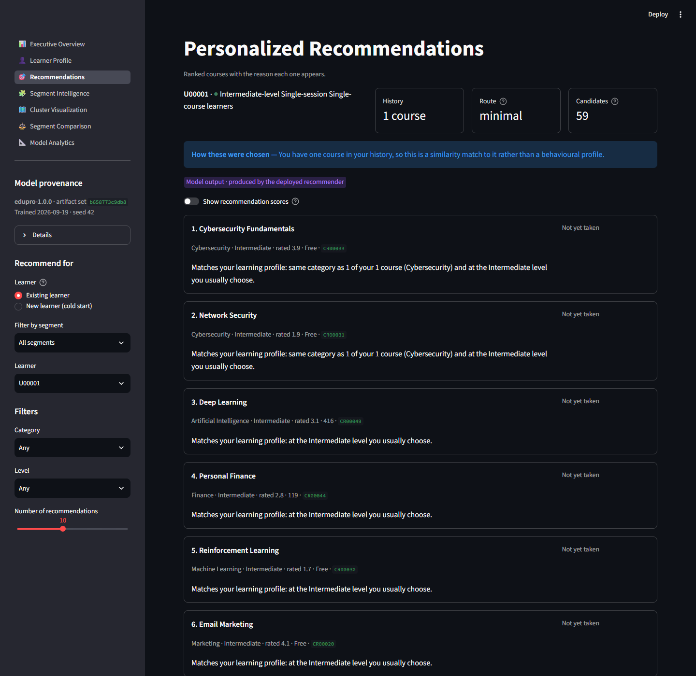
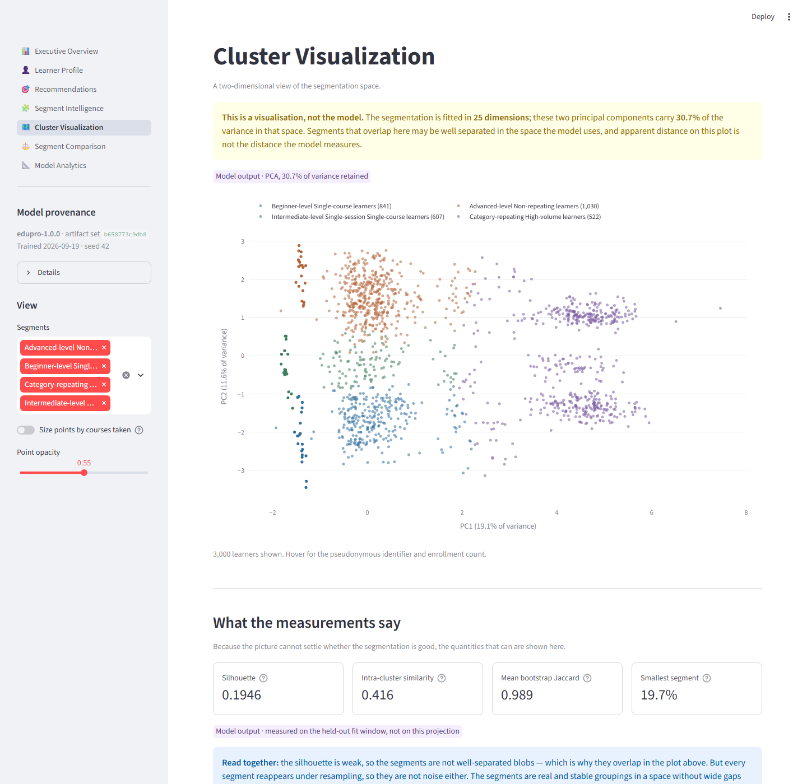
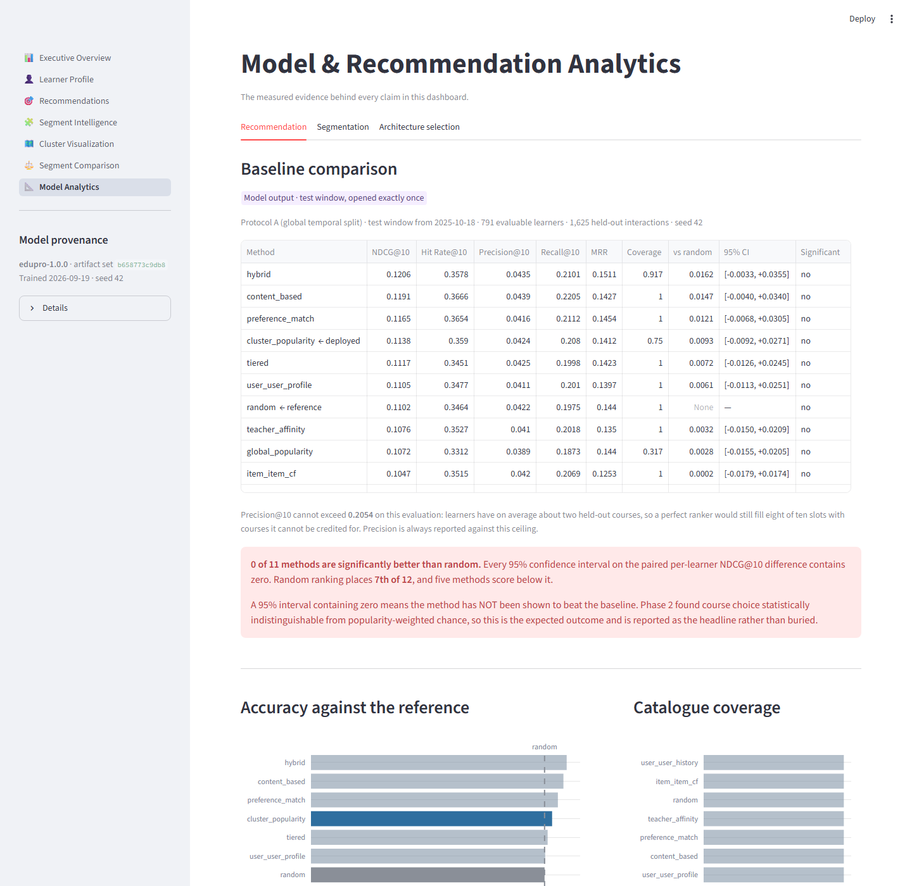

# Student Segmentation and Personalized Course Recommendation System for EduPro

A reproducible, explainable learner segmentation and course recommendation system,
built as a research-grade engineering project rather than a notebook.

**Status:** complete · **Model version:** `edupro-1.0.0` · **Tests:** 385 passing
**Live dashboard:** <https://edupro-learner-intelligence-pmejbef8znwugts2gwtqik.streamlit.app/>
**Deliverables:** [research paper](docs/research_paper.md) · [executive summary](docs/executive_summary.md) · [dashboard](https://edupro-learner-intelligence-pmejbef8znwugts2gwtqik.streamlit.app/)

---

> ### ⚠ The headline finding, stated first
>
> **No recommendation method in this study performs better than random ranking on
> this dataset.** Eleven methods were evaluated on a leakage-free temporal split of
> 791 learners; every 95% confidence interval on the difference against random
> contains zero, and five methods score *below* random.
>
> This is a property of the data, not a defect in the system. Before any
> recommender was built, a permutation test established that course choice here is
> statistically indistinguishable from popularity-weighted chance. Course
> popularity is near-uniform (Gini 0.042) and 54% of learners have taken exactly
> one course.
>
> The **segmentation works** and is usable. The recommendation system is built,
> tested, deployable, and honest about what it cannot demonstrate. Reporting that
> plainly is the point of the project.

---

# Project Overview

EduPro is an online learning platform with 3,000 learners and 60 courses. This
project answers two questions with evidence:

1. **Can learners be grouped into stable, interpretable segments?** Yes — four of
   them, each reappearing reliably under resampling.
2. **Can course choice be predicted from enrollment history?** Not from this data.
   The system that would do it is built and measured; the measurement says no.

The work follows a phase-gated method: research → data audit → experiments →
architecture freeze → implementation → validation → documentation. Each phase
produced a report with a PASS/FAIL decision backed by evidence
([`research/`](research/)).

# Problem Statement

Given an enrollment history, group learners into actionable segments and recommend
the next course to each one — with explanations a learner or administrator can
check, and without claiming performance that has not been measured.

The harder problem underneath: **determine whether the data supports personalised
recommendation at all**, and report that determination either way. On a 60-course
catalogue a ranker that has learned nothing still achieves Hit Rate@10 ≈ 0.35, so a
system evaluated without a random baseline will look successful regardless of
whether it works.

# Objectives

| # | Objective | Outcome |
| --- | --- | --- |
| 1 | Aggregate transactions to learner level with behavioural, engagement and preference features | 25 features in 4 blocks; all 11 brief-mandated features implemented |
| 2 | Segment learners with K-Means, validated by hierarchical clustering | k = 4, selected by a pre-registered rule |
| 3 | Compare at least five recommendation approaches on evidence | 11 methods evaluated on two protocols |
| 4 | Evaluate with leakage control | 6 controls, verified by experiment |
| 5 | Explain every recommendation faithfully | 30,000 explanations verified exhaustively |
| 6 | Handle sparse and cold-start learners explicitly | 4-tier routing; 100% of learners served |
| 7 | Deliver a deployable, reproducible system | 12 artifacts, 276 KB; app loads in 0.41 s |
| 8 | Report limitations honestly | The negative result leads every document |

# Key Features

- **Evidence-based model selection.** Ten feature representations and eleven
  recommenders compared; the highest-scoring option was rejected in both cases for
  documented reasons.
- **Leakage control verified by experiment.** A synthetic future interaction is
  injected and the training features must come back byte-identical.
- **Explanations generated from the scorer's own decomposition** — the number in
  *"127 learners in your segment enrolled in this course"* is the value the ranking
  used, checked across all 30,000 explanations.
- **Honest degradation.** Learners who cannot be personalised are told so, not
  shown a popularity list dressed as personalisation.
- **Privacy by construction.** Names and emails are dropped at ingestion; a scan of
  858 real values across 190 tracked files finds zero.
- **Reproducible.** Eight headline results recompute exactly, in two independent
  environments.
- **Adversarially validated.** A 59-probe audit that found and fixed three real
  defects in this codebase.

# Architecture

```
Raw workbook (immutable, checksum-verified)
        │
        ▼  load ─── PII dropped here
   validate ─── 12 check families, refuses to train on error
        │
        ▼  join ─── 10,000 interactions
   temporal split ─── train │ validation │ test (opened once)
        │
        ├──▶ learner features (25) ──▶ StandardScaler ──▶ K-Means k=4 ──▶ 4 segments
        │
        ▼
   FitContext ──▶ TieredRecommender ──▶ ranked list + explanation
        │
        ▼
   persisted artifacts (12 files, 276 KB) ──▶ Streamlit dashboard
```

The application contains **no machine learning**: it loads persisted artifacts
through `edupro.inference`. A test greps every file under `app/` for model calls
and fails if any appears.

Full detail: [`docs/technical_architecture.md`](docs/technical_architecture.md) ·
[`research/ARCHITECTURE_FREEZE.md`](research/ARCHITECTURE_FREEZE.md) ·
[`research/architecture_diagram.md`](research/architecture_diagram.md)

# Dataset

`data/raw/EduPro Online Platform.xlsx` — SHA-256 `ed555e46…8cc0`, immutable and
verified before every run.

| Property | Value |
| --- | --- |
| Learners / Courses / Enrollments | 3,000 / 60 / 10,000 |
| Categories | 12, exactly 5 courses each |
| Matrix density | 5.56% |
| Repeat (learner, course) pairs | **0** — the signal is purely binary |
| Enrollments per learner: mean / median / max | 3.333 / **1** / 16 |
| Learners with exactly one enrollment | **54.0%** |
| Course popularity range | 140–196 (Gini 0.042) |
| Missing values | **0** across 4 sheets, 27 columns |
| Validation errors | **0** |

**The dataset is assessed as almost certainly synthetic** — zero missing values,
perfectly balanced categories, uniform demographics. Findings should be read as
provisional until confirmed on live data.

Audit: [`research/dataset_audit.md`](research/dataset_audit.md)

# Feature Engineering

25 features in four blocks. All eleven features named in the official brief are
implemented.

| Block | Features |
| --- | --- |
| Engagement (4) | `total_courses`, `avg_courses_per_category`, `enrollment_frequency`, `activity_span_days` |
| Behavioural (6) | `avg_course_rating`, `avg_spend`, `diversity_score`, `learning_depth_index`, `free_ratio`, `diversity_ratio` |
| Category (12) | `cat_share_*` — a row-normalised share vector |
| Level (3) | one-hot preferred level |

**Excluded on evidence, not preference:** age and gender (identical partition,
ARI 1.000); teacher features (+0.0009 silhouette, correlate +0.963 with enrollment
volume); `total_spend` (r = +0.84 with `total_courses`); a level-progression slope
(measured p = 0.664 — no progression exists).

`avg_spend` is retained because the brief mandates it, with its degeneracy
documented: `Amount` equals `CoursePrice` on all 10,000 rows.

Course side: an 18-dimensional content vector (category, level, type, rating,
duration). Titles are excluded — 58 distinct names across 60 courses.

# Learner Segmentation

**Behaviour-only features → StandardScaler → K-Means (k-means++, n_init=10, seed 42), k = 4.**

k was chosen by a **pre-registered rule**: maximise silhouette subject to *every*
segment holding ≥5% of learners **and** reaching bootstrap Jaccard ≥0.60.
Unconstrained, silhouette selects k = 10 — where five of ten clusters fail to
reappear under resampling.

| Segment | Learners | Share | Courses | Active span |
| --- | --- | --- | --- | --- |
| Advanced-level Non-repeating | 1,030 | 34.3% | 1.6 | 62 days |
| Beginner-level Single-course | 841 | 28.0% | 1.5 | 46 days |
| Intermediate-level Single-session | 607 | 20.2% | 1.4 | 29 days |
| **Category-repeating High-volume** | **522** | **17.4%** | **12.0** | **296 days** |

Quality: silhouette 0.1946 · intra-cluster similarity 0.416 · mean bootstrap
Jaccard 0.9892 · seed-stability ARI 0.99959.

**Stated plainly:** three of the four segments are largely *course-level*
groupings, not behavioural personas. Only the high-volume segment is a distinct
behavioural group. Hierarchical validation is a **negative result** — average
linkage agrees with K-Means at ARI 0.019.

Detail: [`research/segmentation_results.md`](research/segmentation_results.md) ·
[`research/cluster_profiles.md`](research/cluster_profiles.md)

# Recommendation System

A **four-tier switching recommender**, routed on training-window history only:

| History | Learners | Route |
| --- | --- | --- |
| 0 | new learners only | `DiversifiedFallback` — popularity + rating, re-ranked round-robin across categories |
| 1 | 1,620 | `ContentBased` |
| 2–8 | 926 | `ClusterPopularity` |
| ≥ 9 | 454 | `ClusterPopularity` |

Tier boundaries come from the data: the enrollment histogram has a hard empty band
at 5–8, so the moderate/rich cut passes through a region containing no learners.

Eleven methods were evaluated before the hybrid was proposed. A weighted hybrid led
the field but **lost a pre-registered parsimony rule** (0.0051 margin against a
0.01 threshold), so the simpler method was deployed.

Detail: [`research/recommendation_results.md`](research/recommendation_results.md)

# Evaluation

**Protocol A — global temporal split**, the primary and leakage-free protocol:
train < 2025-09-12 · validation → 2025-10-18 · test ≥ 2025-10-18, **opened once**.

Test window, 791 evaluable learners, K = 10:

| Method | NDCG@10 | Hit Rate | Coverage | Δ vs random | Significant? |
| --- | --- | --- | --- | --- | --- |
| hybrid | 0.1206 | 0.3578 | 0.92 | +0.0162 | No |
| content_based | 0.1191 | 0.3666 | 1.00 | +0.0147 | No |
| **cluster_popularity** *(deployed core)* | 0.1138 | 0.3590 | 0.75 | +0.0093 | No |
| tiered *(deployed architecture)* | 0.1117 | 0.3451 | **1.00** | +0.0072 | No |
| **random** *(reference)* | **0.1102** | **0.3464** | 1.00 | — | — |
| global_popularity | 0.1072 | 0.3312 | **0.32** | +0.0028 | No |
| user_user_history | 0.0947 | 0.3097 | 1.00 | −0.0098 | No |

**0 of 11 methods are significantly better than random.** Random ranks 7th of 12.

Precision@10 is always reported against its analytical ceiling of **0.2054** —
learners have ~2 held-out courses, so a perfect ranker still fills eight of ten
slots with courses it cannot be credited for.

**Impact proxy.** The brief requires an impact metric; the data supports no causal
one. Engagement Lift is reported as a **proxy**, always beside random's own value:
**1.084 against 1.046**. It is not a measure of engagement, completion or retention
— EduPro records none of those.

Six leakage controls are verified in-run, and the leakage checker is itself tested
against a deliberately leaky fixture so it is known capable of failing.

# Explainability

Explanations are **model-intrinsic**: the scoring interface returns per-component
contributions, a decision taken before any recommender was written because
faithfulness cannot be retrofitted.

> *"127 learners in your segment (Category-repeating High-volume learners) enrolled
> in this course."*

Three rules, enforced in code and verified across **all 30,000 explanations**
(3,000 learners × 10):

| Property | Violations |
| --- | --- |
| Names only components the model used | 0 |
| The quoted number equals the scorer's contribution | 0 |
| Category claims true of the learner's real history | 0 |
| Cold-start lists never imply personalisation | 0 |

# Privacy

`UserName`, `Email` and `TeacherName` are dropped **at ingestion** — not filtered
later. Nothing downstream has them, so a leak would require circumventing the
loader.

| Check | Result |
| --- | --- |
| PII in any persisted artifact | **None** — 858 real values searched across 184 tracked files |
| Learner identification | Pseudonymous `UserID` only |
| Email as a modelling feature | Never — it does not exist downstream |
| Age/gender in the model | No. Retained for fairness auditing only |

**Fairness.** Demographic strata show female learners at NDCG@10 0.1002 against
male learners at 0.1285 — nominally significant, uncorrected for four strata tests,
on a system that uses no demographic feature and performs at chance overall. It is
reported, bounded, and flagged for monitoring on real data rather than dismissed.

# Streamlit Application

Seven pages, built entirely on the production model:

| Page | Shows |
| --- | --- |
| Executive Overview | Population, segments, routing, validated metrics, key insights |
| Learner Profile | One learner's behaviour, preferences, segment and history |
| Recommendations | Explained top-K, category/level filters, explicit cold-start mode |
| Segment Intelligence | Segment behaviour and **the evidence behind each name** |
| Cluster Visualization | 2D view, with its 30.7% retained variance stated up front |
| Segment Comparison | Segments against the population average |
| Model Analytics | Every measured number, loaded from experiment artifacts |

Three rules the dashboard enforces rather than leaving to the reader: every figure
is badged **observed / model output / proxy**; no quality figure renders without its
random reference; and nothing is typed in — measured values are read from artifacts,
so the dashboard *cannot* display a number no experiment produced.

# Screenshots / Demo

Generated from the running app by
[`scripts/capture_screenshots.py`](scripts/capture_screenshots.py) — regenerable in
one command, so they cannot silently go stale.

**Executive Overview**


**Personalized Recommendations** — every course carries the reason it appears


**Cluster Visualization** — the caveat is shown *before* the chart


**Model Analytics** — the random baseline is a row in the table, not a footnote


Also captured: [Learner Profile](docs/screenshots/02_learner_profile.png) ·
[Segment Intelligence](docs/screenshots/04_segment_intelligence.png)

# Installation

```bash
py -3.13 -m venv .venv
.venv/Scripts/activate          # Windows;  source .venv/bin/activate elsewhere
pip install -r requirements.txt
pip install -e . --no-deps
```

**Python 3.13.9** (supported: ≥3.11, <3.14). Dependencies are pinned exactly;
`requirements.lock.txt` records the fully frozen environment.

> Use `py -3.13` explicitly. On a machine whose default `python` is 3.14 the project
> correctly refuses to install, but the first error you see is an unrelated
> dependency failure. On Windows, install at a short path — a ~250-character path
> fails with an opaque missing-DLL error (`MAX_PATH`, not a broken dependency).

For tests and tooling: `pip install -r requirements-dev.txt`.

# Running the Pipeline

The production artifact set is **committed**, so this is only needed if the data
changes:

```bash
python scripts/train_production_model.py
```

~16 seconds; writes 12 files (276 KB) to `models/` and `artifacts/production/`.

# Running the Application

```bash
streamlit run app/streamlit_app.py
```

Opens at <http://localhost:8501>. Loads in 0.41 s and fits nothing.

Without the dashboard:

```bash
python scripts/recommend.py --describe                 # which artifact set is loaded
python scripts/recommend.py --user U00001              # explained top-10
python scripts/recommend.py --user U00001 --category "Data Science" --level Beginner
python scripts/recommend.py --user NEW-LEARNER         # cold-start route
```

# Retraining / Reproducing Results

```bash
python scripts/verify_reproducibility.py     # 8 stored results, recomputed from scratch
python scripts/verify_paper_claims.py        # 96 document figures vs the artifacts
python scripts/adversarial_audit.py          # 59 probes across data, leakage, privacy
python scripts/app_smoke_test.py             # 20 probes across the dashboard
```

To regenerate the research artifacts themselves:

```bash
python scripts/run_data_audit.py
python scripts/run_segmentation_experiments.py
python scripts/run_recommendation_experiments.py
python scripts/validate_final_architecture.py
```

Every script writes a JSON artifact whose `provenance` block records the workbook
checksum, the seed, the split dates and the evaluable-learner count.

**Reproducibility evidence** — recomputed in the development environment *and* in a
clean environment built from `requirements.txt`:

| Result | Stored | Recomputed |
| --- | --- | --- |
| Silhouette, k=4 | 0.194600 | 0.194600 |
| Mean bootstrap Jaccard | 0.989200 | 0.989200 |
| NDCG@10, random | 0.110215 | 0.110215 |
| NDCG@10, cluster popularity | 0.113773 | 0.113773 |
| NDCG@10, architecture C | 0.110354 | 0.110354 |

**8 of 8 exact.** Seed 42 governs every stochastic operation.

# Project Structure

```
.
├── app/                    Streamlit dashboard — 7 pages, no ML of its own
│   ├── streamlit_app.py    entry point; declares navigation
│   ├── lib/                page furniture and cached loaders
│   └── pages/              the seven pages
├── artifacts/              every generated output
│   ├── eda/                10 figures from the data audit
│   ├── segmentation/       10 figures + results JSON + CSVs
│   ├── recommendation/     8 figures + results JSON
│   ├── architecture/       assembled-architecture measurement
│   ├── validation/         adversarial audit + smoke-test results
│   └── production/         the served artifact set (8 files)
├── data/raw/               IMMUTABLE source workbook
├── docs/                   paper, executive summary, architecture, deployment,
│                           traceability, screenshots
├── models/                 fitted scaler + clusterer + manifest (4 files)
├── notebooks/              exploration only — never the sole implementation
├── references/official/    authoritative brief + verbatim transcript
├── research/               decision log, experiment log, ADRs, phase reports
├── scripts/                reproducible entry points (18)
├── src/edupro/             production package (32 modules)
└── tests/                  385 tests across 9 suites
```

| Area | Files | Lines |
| --- | --- | --- |
| `src/edupro/` | 32 | 5,972 |
| `scripts/` | 18 | 5,989 |
| `tests/` | 9 | 2,855 |
| `app/` | 11 | 2,041 |

# Testing

```bash
python -m pytest tests -q        # 385 passed, ~3 minutes
```

| Suite | Tests | Covers |
| --- | --- | --- |
| `test_phase0_environment.py` | 29 | Layout, imports, config, no-Docker, determinism |
| `test_data_pipeline.py` | 36 | Loading, checksum, **PII absence**, validation, joins, features |
| `test_segmentation.py` | 37 | Representations, clustering, stability, naming guards |
| `test_recommendation.py` | 59 | All scorers, candidate exclusion, tiering, metrics |
| `test_production.py` | 56 | Artifacts, versioning, inference, explanations, privacy |
| `test_app.py` | 26 | Every dashboard page executed via `AppTest` |
| `test_regressions.py` | 15 | Defects found by the adversarial audit and the first deployment |
| `test_paper.py` | 74 | Document structure, references, **forbidden claims** |
| `test_repository.py` | 44 | Hygiene: no cruft, secrets, PII or local paths; README accuracy |

Notable guards, each protecting a mistake actually made during development: segment
names may not use a feature the model did not see; the leakage checker must fail on
a leaky fixture; a zero-weight component must not appear in an explanation; the
dashboard's tables must reproduce the frozen document; and no document may *assert*
an unsupported causal claim — while still being allowed to quote one in order to
refuse it.

# Limitations

1. **No method beats random on this dataset.** The central limitation.
2. **Engagement, completion and outcomes cannot be measured** — EduPro records none.
3. **The dataset is assessed as almost certainly synthetic.**
4. **Three of four segments are course-level groupings**, not behavioural personas.
5. **The structure is not algorithm-independent** — average linkage agrees at ARI 0.019.
6. **No instrument can falsify cluster structure here** — the gap statistic, added
   for exactly that purpose, returned no verdict over k = 1…20.
7. **Missing-not-at-random**: a non-enrollment is not a negative; no impression data.
8. **The system is blind to level-switching** — 0.6% hit rate when the held-out
   course is at an unseen level.
9. **Popularity bias is present** despite near-uniform popularity.
10. **A gender gap is under monitoring**, uncorrected for multiple comparisons.
11. **Artifact staleness is not automated** — the manifest detects an *inconsistent*
    set, not an *old* one.

# Future Work

1. **Re-run on real interaction data.** Every method and control transfers unchanged.
2. **Capture what is missing**: completion, progress, dwell time, learner-given
   ratings, and impression logs. Without impressions, missing-not-at-random cannot
   be addressed at all.
3. **Online evaluation.** No offline proxy can establish engagement impact.
4. **Revisit matrix factorisation** once repeat interactions exist — the mechanical
   objection disappears.
5. **Address level-switching** with a curriculum-aware component.
6. **Monitor the demographic gap** with multiple-comparison correction.

# Deployment

Streamlit Community Cloud, deployed from this repository. **No Docker.**

1. Push to GitHub.
2. At <https://share.streamlit.io>, point an app at `app/streamlit_app.py` on `main`.
3. Set Python 3.13 in *Advanced settings* if offered.

No secrets, environment variables or external services are required. The artifact
set is committed because the platform cannot run the training pipeline.

**Deployment readiness: 25 of 25 checks pass**
(`python scripts/deployment_readiness.py`), covering secrets, personal data,
artifact availability from a fresh clone, startup cost, determinism, dependency
compatibility, path safety, Linux filename case sensitivity, and the absence of
container configuration.

**Status: live and verified** at
<https://edupro-learner-intelligence-pmejbef8znwugts2gwtqik.streamlit.app/>.
Confirmed in a browser on 20 September 2026: the sidebar reports artifact set
`6892a4f9ef27` — the set committed here — the Recommendations page routes a
learner and returns ranked courses with per-item explanations, and Model Analytics
loads the experiment artifacts.

It failed twice before it worked, and the second failure is worth reading about.
Both times every page showed the artifacts empty state although the artifacts were
committed. The first cause found was `.gitattributes` line-ending normalisation,
which made three JSON artifacts hash differently on Linux than the hashes recorded
on Windows. That defect was real, it was fixed, and it was **not** the cause.

The cause was that the manifest recorded its keys with `str(Path)` — the *platform*
separator — so a set written on Windows listed `models\scaler.joblib`. On Linux
that is one filename containing a backslash, not a path, so all twelve artifacts
resolved to nothing and were reported missing.

The first fix had been verified three ways: a readiness probe, regression tests,
and hashing a fresh `git clone`. All three passed. All three called
`rel.replace("\\", "/")` before using the key — reasonable on its own, since git
speaks POSIX, and collectively it meant no check ever saw the separator the
application would use. Manifest keys are now POSIX, and a probe plus four
regression tests read them **verbatim**.

What found it was not a test but the empty-state page, after it was changed to
print the loader's actual error and to stop saying "not found" for artifacts that
were present. Full account: [`docs/deployment_guide.md`](docs/deployment_guide.md)
§6.1.

Step-by-step guide, settings and troubleshooting:
[`docs/deployment_guide.md`](docs/deployment_guide.md).
Operational notes: [`docs/deployment.md`](docs/deployment.md).

# References

Forty references were verified by retrieval — title, authors, venue, year and
identifier confirmed against a publisher page, DBLP or the canonical proceedings
listing. The annotated review is in
[`research/literature_review.md`](research/literature_review.md) and the citation
list in [`docs/research_paper.md`](docs/research_paper.md) §25.

Most directly load-bearing:

- **Rousseeuw (1987)** — silhouette. DOI: 10.1016/0377-0427(87)90125-7
- **Tibshirani, Walther & Hastie (2001)** — gap statistic. DOI: 10.1111/1467-9868.00293
- **Hennig (2007)** — cluster-wise stability. DOI: 10.1016/j.csda.2006.11.025
- **Burke (2002)** — hybrid recommender taxonomy. DOI: 10.1023/A:1021240730564
- **Järvelin & Kekäläinen (2002)** — NDCG. DOI: 10.1145/582415.582418
- **Meng et al. (2020)** — data-splitting strategies change method rankings. DOI: 10.1145/3383313.3418479
- **Ferrari Dacrema, Cremonesi & Jannach (2019)** — baselines beat most published neural recommenders. DOI: 10.1145/3298689.3347058
- **Ge, Delgado-Battenfeld & Jannach (2010)** — coverage beyond accuracy. DOI: 10.1145/1864708.1864761
- **Zhang & Chen (2020)** — explainable recommendation. DOI: 10.1561/1500000066
- **Sculley et al. (2015)** — hidden technical debt in ML systems.

# License

MIT — see `pyproject.toml`.

The **source dataset and the official project brief** under `data/raw/` and
`references/official/` are the property of their respective owners and are included
for reproducibility of this submission, not redistributed under the MIT licence.

---

### Documentation index

| Document | Audience |
| --- | --- |
| [Research paper](docs/research_paper.md) · [HTML](docs/research_paper.html) | Technical reviewer |
| [Executive summary](docs/executive_summary.md) | Management, administrators, reviewers |
| [Technical architecture](docs/technical_architecture.md) | Engineers |
| [Deployment guide](docs/deployment_guide.md) · [operations](docs/deployment.md) | Whoever deploys it |
| [Requirements traceability](docs/REQUIREMENTS_TRACEABILITY.md) | Assessors |
| [Submission checklist](docs/submission_checklist.md) | Assessors |
| [Architecture freeze](research/ARCHITECTURE_FREEZE.md) | The frozen design + evidence |
| [Final validation report](research/final_validation_report.md) | The adversarial audit |
| [Decision log](research/decision_log.md) | 62 recorded decisions |
| [Experiment log](research/experiment_log.md) | 29 experiments, including failures |
