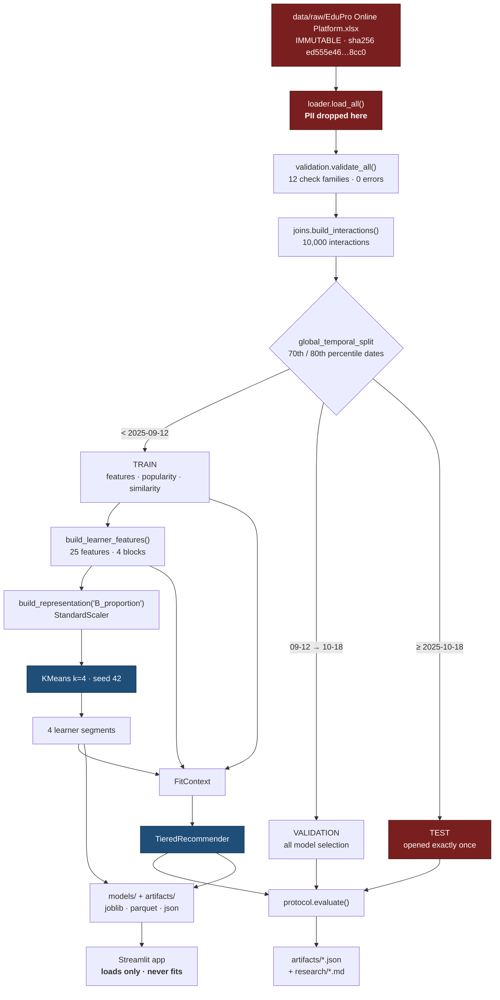
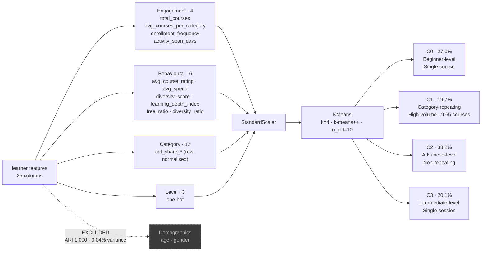
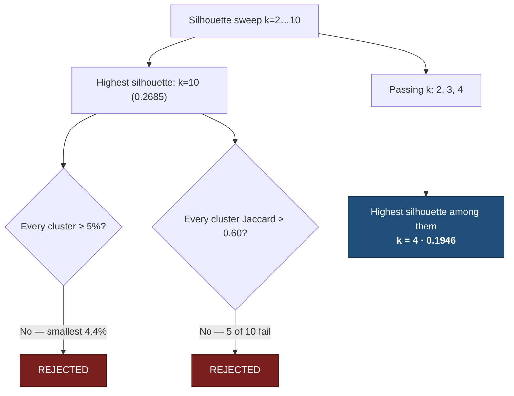
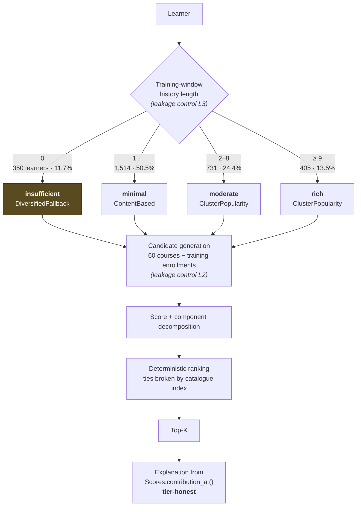
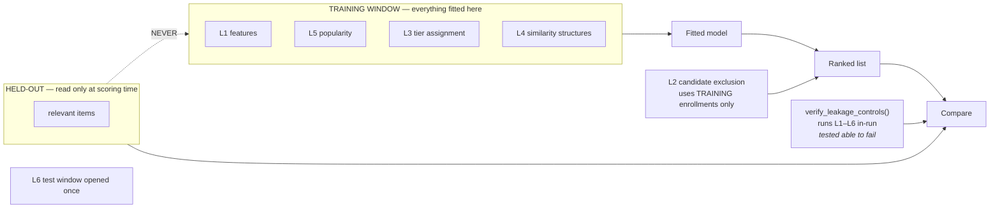
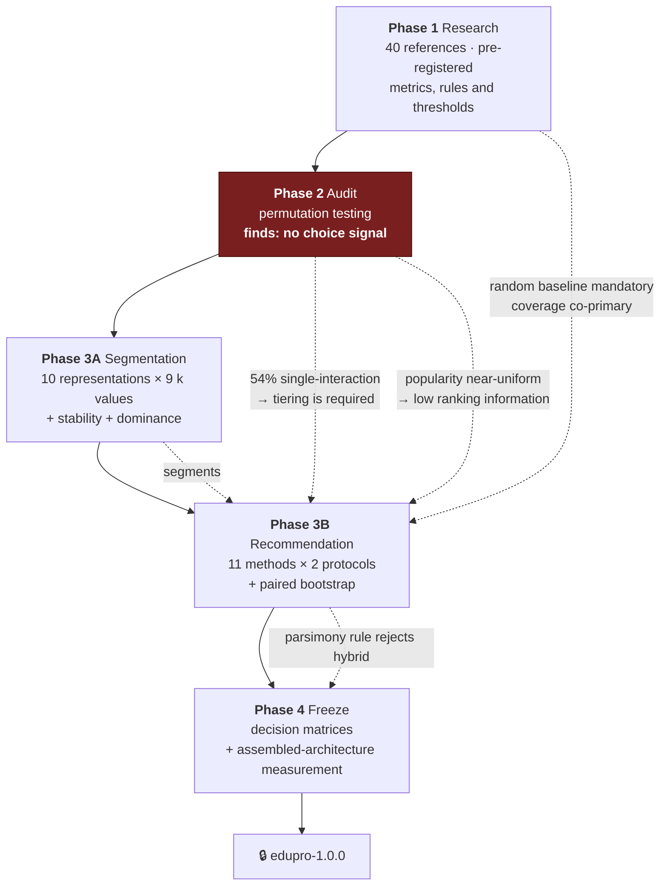
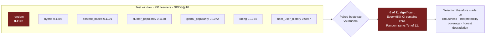
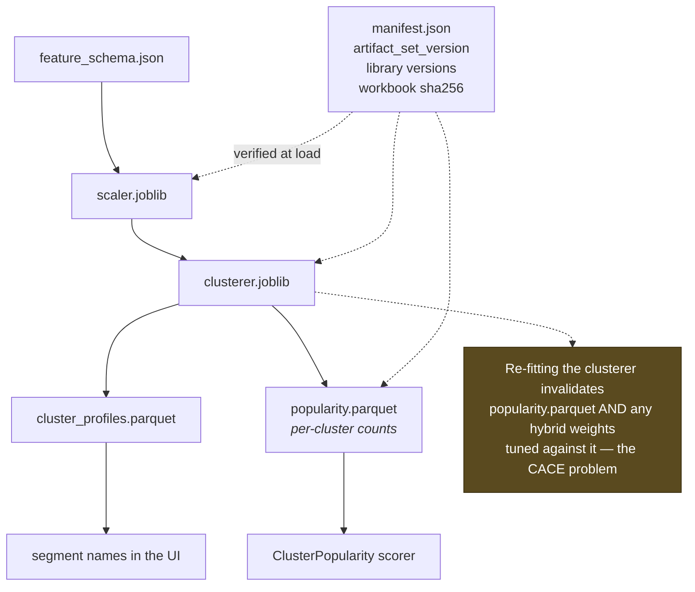

# Architecture Diagrams

Visual companion to `research/ARCHITECTURE_FREEZE.md` and
`docs/technical_architecture.md`. Mermaid renders natively on GitHub.

Version `edupro-1.0.0`, frozen 19 September 2026.

---

## 1. End-to-end system

---

## 2. Segmentation layer

**Why k=4 and not the highest-silhouette k:**

---

## 3. Recommendation routing

**Coverage of the routing:** 3,000 of 3,000 learners receive a recommendation.
Minimum candidate pool 45 of 60, so top-10 can always be filled. Zero empty pools.

---

## 4. Leakage controls

Using **full** history for candidate exclusion would leak: removing the held-out
course from the candidate pool tells the model which course to avoid, which is
information about the answer.

---

## 5. Evidence flow — how decisions were reached

---

## 6. The finding that governs presentation

Any dashboard or report figure quoting recommendation quality must show the random
reference beside it.

---

## 7. Artifact dependency — why the set is versioned together

